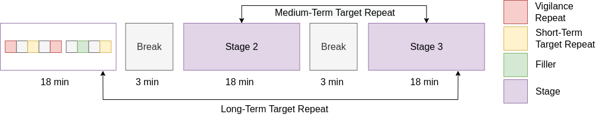

# Experiment Website
## Implementation of *The Music Memory Game*

- Labeling procedure to measure music memorability
- Idea adopted from *[The Visual Memory Game](https://ieeexplore.ieee.org/stamp/stamp.jsp?tp=&arnumber=6629991&tag=1)*

## File Usage

- [clips/](clips): store the collected
 audio samples
- [index.php](index.php), [home.css](home.css): homepage construction
- [experiment.html](experiment.html), [experiment.css](experiment.css), [experiment.js](experiment.js): experiment procedures
- [insert_row_to_db.php](insert_row_to_db.php), [query_db.php](query_db.php), [update_db.php](update_db.php): for experiment results update in the MySQL database